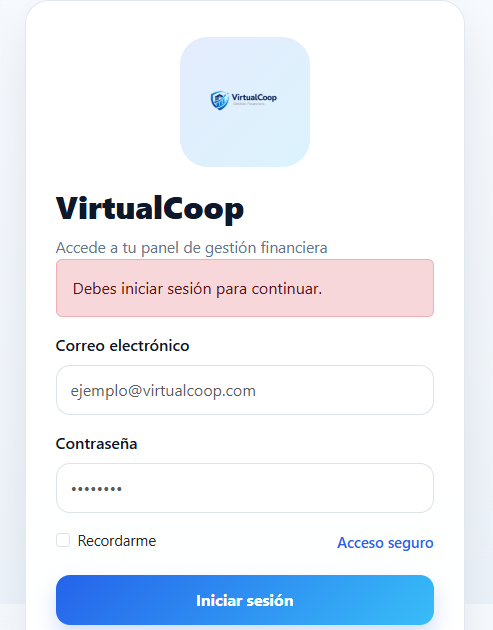
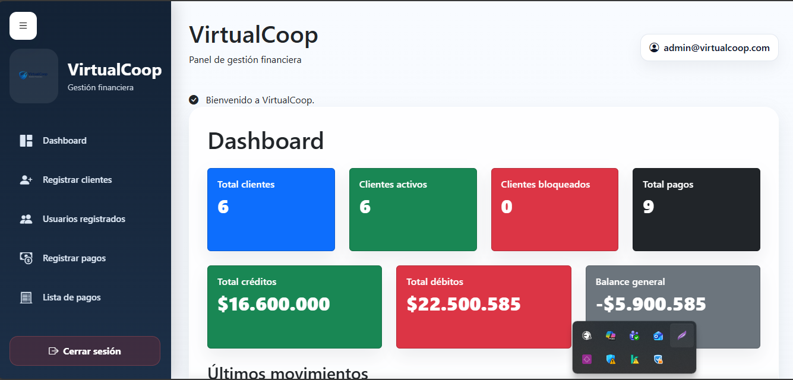
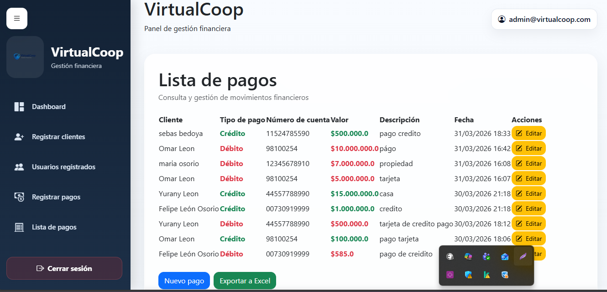

# VirtualCoop

Sistema web desarrollado en **Ruby on Rails** para la gestión de clientes y pagos, con autenticación, dashboard financiero y exportación de datos.

## Descripción

VirtualCoop es una aplicación orientada a la administración de clientes y movimientos financieros.  
Permite registrar clientes, gestionar su estado, registrar pagos, consultar historial de movimientos y visualizar métricas en un dashboard.

El proyecto fue desarrollado bajo arquitectura **MVC**, usando **PostgreSQL** como base de datos relacional y una interfaz web con enfoque visual tipo sistema empresarial.

---

## Funcionalidades principales

### Gestión de clientes
- Registro de clientes
- Validación de campos obligatorios
- Validación de correo electrónico
- Validación de documento único
- Búsqueda por documento
- Edición de clientes
- Bloqueo y desbloqueo de clientes
- Orden visual de clientes activos y bloqueados

### Gestión de pagos
- Registro de pagos asociados a clientes existentes
- Tipos de pago: Crédito / Débito
- Validación numérica del valor
- Descripción opcional
- Lista de pagos por cliente
- Edición de pagos para corrección de errores
- Ordenamiento por fecha
- Colores diferenciados por tipo de movimiento

### Dashboard
- Total de clientes
- Clientes activos
- Clientes bloqueados
- Total de pagos
- Total de créditos
- Total de débitos
- Balance general
- Tabla de últimos movimientos
- Gráfica financiera con Chart.js

### Seguridad
- Login de administrador
- Contraseñas seguras con bcrypt
- Manejo de sesiones
- Protección de rutas
- Cierre de sesión

### Exportación
- Exportación de pagos a Excel

---

## Tecnologías utilizadas

- Ruby
- Ruby on Rails
- PostgreSQL
- Bootstrap 5
- CSS personalizado
- Chart.js
- Axlsx
- Bcrypt

---

## Arquitectura

El proyecto fue desarrollado siguiendo el patrón **MVC (Model - View - Controller)**:

- **Modelos:** gestión de entidades y validaciones
- **Vistas:** interfaz de usuario
- **Controladores:** flujo de la aplicación y lógica de interacción

Base de datos estructurada en **Tercera Forma Normal (3FN)**.

---

## Modelado principal

### Entidades
- Client
- DocumentType
- AccountType
- Payment
- PaymentType
- User

### Relaciones
- Un cliente pertenece a un tipo de documento
- Un cliente pertenece a un tipo de cuenta
- Un cliente tiene muchos pagos
- Un pago pertenece a un cliente
- Un pago pertenece a un tipo de pago

---

## Capturas del sistema

### Login


### Dashboard


### Lista de pagos


---

## Instalación local

1. Clonar el repositorio

```bash
git clone https://github.com/Leonosorio/virtual-coop.git
cd virtual-coop